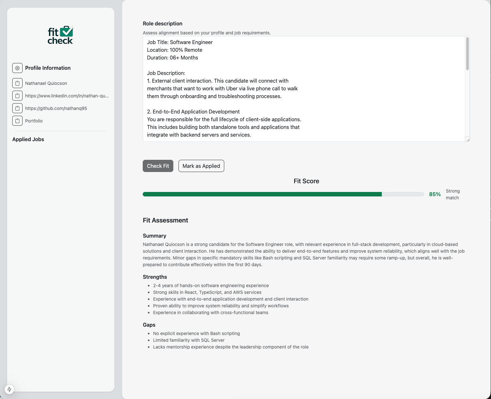
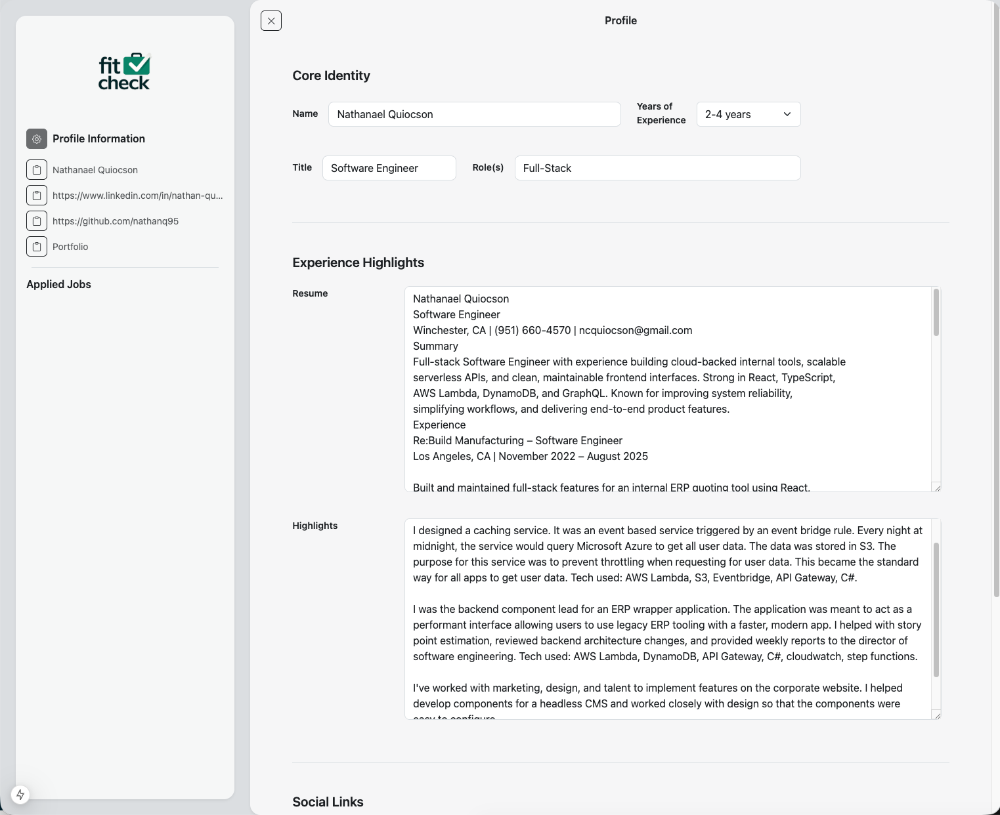

# FitCheck



FitCheck is a decision-first job application assistant that uses your core info, resume, and career highlights to evaluate whether a role is worth applying to. It explains why you’re a good fit, calls out potential gaps or dealbreakers, and stays open alongside the application process to support better decisions without automating or taking control away.

## Features
- Profile editor with core identity, experience highlights, and social links
- Role description fit check with score, summary, strengths, and gaps
- Local profile persistence via `localStorage`
- One-click copy for profile info like LinkedIn and GitHub links
- Clean UI built with React Bootstrap

## Coming soon
- Save and track applied jobs

## Tech stack
- Next.js 15 (App Router)
- React 19
- React Bootstrap + Bootstrap Icons
- OpenAI API (server route)

## Getting started

### 1) Install dependencies
```bash
npm install
```

### 2) Configure environment
Create a `.env` file in the project root:
```bash
OPENAI_API_KEY=your_key_here
```

### 3) Run the app
```bash
npm run dev
```
Open `http://localhost:3000` in your browser.

## How it works
- The client stores your profile locally in the browser.
- Submitting a role description sends your profile + role text to `app/api/fit/route.ts`.
- The server calls the OpenAI API and returns a JSON response with score + insights.

## Scripts
- `npm run dev` — start dev server
- `npm run build` — production build
- `npm run start` — start production server

## Notes
- The API route requires a valid `OPENAI_API_KEY`.
- The fit evaluation is based only on the content you provide.

## License
See `LICENSE`.
